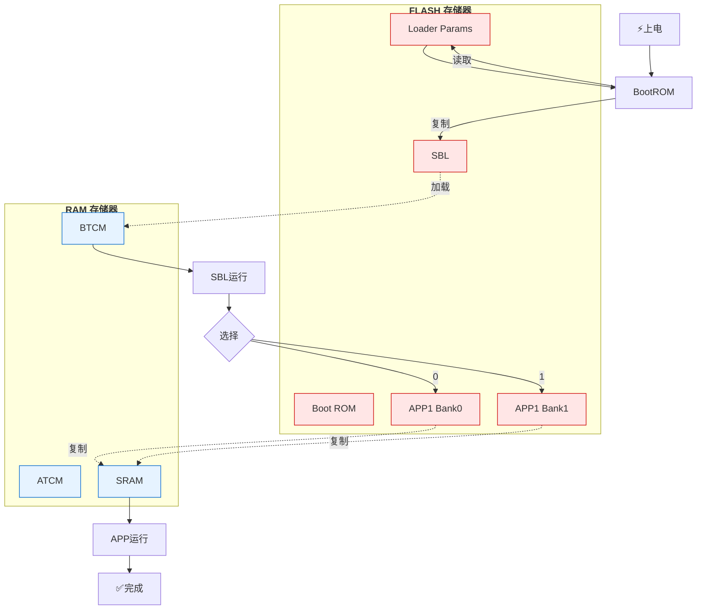

1、
SDK环境要求
- Window 10/11
- Renesas e² studio Version: 2025-07 (25.7.0)
- RZN FSP 2.0.0
- TwinCAT v3.1.4024.65
- Python 3.12.12
- CN032开发板(RZN2L+KSZ8081+w25q128)

2、
<pre>
RZN2L_Multi-protocol_FW_Upgrade/
├── 0200-rzn2l-ethercat/ [HIDDEN]
├── <strong>common/
│   ├── bsp_r52_global_counter.c
│   ├── bsp_r52_global_counter.h
│   ├── circular_queue.c
│   ├── circular_queue.h
│   ├── crc32_table.c
│   ├── crc32_table.h
│   ├── ecat_foe_data.h
│   ├── flash_config.h
│   ├── log.h
│   ├── sbl_params.c
│   └── sbl_params.h</strong>
├── RZN2L_xspi0_app1/
│   ├── BANK0/
│   │   └── <strong>RZN2L_xspi0_app1_bank0_with_crc.bin</strong>
│   ├── BANK1/
│   │   └── <strong>RZN2L_xspi0_app1_bank1_with_crc.bin</strong>
│   ├── rzn/ [HIDDEN]
│   ├── rzn_cfg/ [HIDDEN]
│   ├── rzn_gen/ [HIDDEN]
│   ├── script/
│   │   ├── <strong>fsp_xspi0_boot_app1_bank0.ld</strong>
│   │   └── <strong>fsp_xspi0_boot_app1_bank1.ld</strong>
│   ├── src/
│   │   ├── ethercat/
│   │   │   ├── beckhoff/
│   │   │   │   └── Src/
│   │   │   │       ├── <strong>bootmode.c</strong>
│   │   │   │       ├── <strong>bootmode.h</strong>
│   │   │   │       ├── ecatfoe.c
│   │   │   │       ├── ecatfoe.h
│   │   │   │       ├── foeappl.c
│   │   │   │       ├── foeappl.h
│   │   │   └── renesas/
│   │   │       ├── samplefoe.c
│   │   │       ├── samplefoe.h
│   │   ├── r_fw_up_rz/ [HIDDEN]
│   │   ├── hal_entry.c
│   │   └── syscall.c
│   ├── <strong>attach_crc_bank0.py</strong>
│   ├── <strong>attach_crc_bank1.py</strong>
│   ├── configuration.xml
│   ├── RZN2L_xspi0_app1.sbd.backup0
│   ├── RZN2L_xspi0_app1.sbd.backup1
│   └── rzn_cfg.txt
├── RZN2L_xspi0_boot_sbl/
│   ├── rzn/ [HIDDEN]
│   ├── rzn_cfg/ [HIDDEN]
│   ├── rzn_gen/ [HIDDEN]
│   ├── script/
│   │   └── <strong>fsp_xspi0_boot_loader.ld</strong>
│   ├── src/
│   │   ├── <strong>APP1_BANK0_Flash_section.s</strong>
│   │   ├── <strong>APP1_BANK1_Flash_section.s</strong>
│   │   ├── hal_entry.c
│   │   ├── <strong>loader_table.c</strong>
│   │   ├── <strong>loader_table.h</strong>
│   │   └── syscall.c
│   ├── configuration.xml
│   ├── RZN2L_xspi0_boot_sbl.srec.backup
│   └── rzn_cfg.txt
├── mytree.sh
└── README.MD
<strong></strong>
<span style="color:red; font-weight:bold"></span>
</pre>

3、

```
FLASH MEMORY MAP (起始地址: 0x6000 0000)
═══════════════════════════════════════════════════════════
             SBL:   
0x6000 0000  ┌─────────────────────────────────────┐
             │ loader_param                        │ 0x4C
0x6000 004c  ├─────────────────────────────────────┤
             │ sbl code                            │ ~512KB
0x6008 0000  ├─────────────────────────────────────┤
             │ sbl LOADER_TABLE                    │ ~508KB
0x600F F000  ├─────────────────────────────────────┤
             │ sbl boot params                     │ 4KB
0x600F FFFF  └─────────────────────────────────────┘
             APP1BANK0：   
0x6010 0000  ┌─────────────────────────────────────┐
             │ .header                             │
             │  ├─ "APP1BANK0" (9B)                │
             │  ├─ app1bank0 length (4B)           │ 0x4C
             │  └─ reserved (0x4C-0x1C=0x30)       │
0x6010 004c  ├─────────────────────────────────────┤
             │ .identify (4x4B)                    │ 16B
0x6010 005c  ├─────────────────────────────────────┤
             │         app1 bank0 code             │
0x601F FFFC  ├─────────────────────────────────────┤
             │ 整区 CRC32 (0x6010_0000-0x6020_0000)│ 4B
0x601F FFFF  └─────────────────────────────────────┘
             APP1BANK1:
0x6020 0000  ┌─────────────────────────────────────┐
             │ .header                             │
             │  ├─ "APP1BANK1" (9B)                │
             │  ├─ app1bank1 length (4B)           │ 0x4C
             │  └─ reserved (0x4C-0x1C=0x30)       │
0x6020 004c  ├─────────────────────────────────────┤
             │ .identify (4x4B)                    │ 16B
0x6020 005c  ├─────────────────────────────────────┤
             │         app1 bank1 code             │
0x602F FFFC  ├─────────────────────────────────────┤
             │ 整区 CRC32 (0x6020_0000-0x6030_0000)│ 4B
0x602F FFFF  └─────────────────────────────────────┘

0x6030 0000  ┌─────────────────────────────────────┐
             │         剩余保留区域                 │
             └─────────────────────────────────────┘
```

4、
