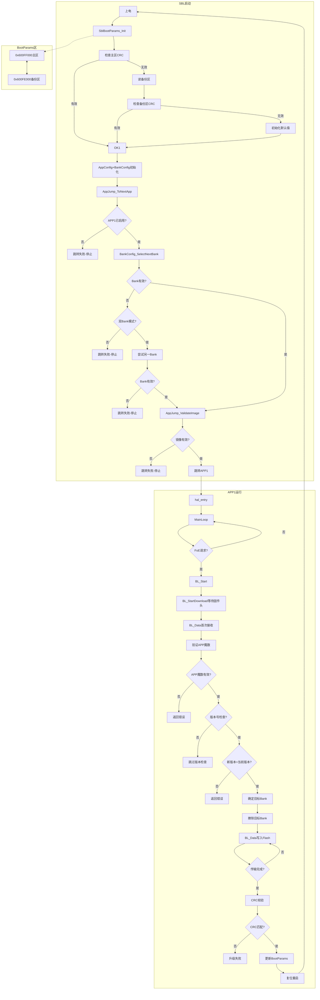

# RZN2L 多协议固件升级系统

## 1. 开发环境要求

| 组件 | 版本要求 |
|------|----------|
| 操作系统 | Windows 10/11 |
| IDE | Renesas e² studio 2025-12 |
| FSP | RZN FSP 2.0.0 |
| EtherCAT主站 | TwinCAT v3.1.4024.65 |
| Python | 3.12.12 |
| 硬件平台 | CN032开发板 RSK/(RZN2L + KSZ8081 + W25Q128) |

## 2. 项目目录结构

```
RZN2L_Multi-protocol_FW_Upgrade/
├── .gitignore                         # Git忽略配置
├── .project                           # e2 studio项目文件
├── README.MD                          # 本文档
├── boot_config_tool.py                # Boot配置命令生成工具
├── boot_config_cmd.bin                # Boot配置命令文件
├── mytree.sh                          # 目录树生成脚本
│
├── common/                            # 公共模块 (SBL和APP1共享)
│   ├── app_config.h/c                 # APP配置管理
│   ├── bank_config.h/c                # Bank配置管理
│   ├── bank_detection.h/c             # Bank检测
│   ├── boot_config_cmd.h/c            # 启动配置命令
│   ├── bsp_r52_global_counter.h/c     # 全局计数器
│   ├── circular_queue.h/c             # 环形队列
│   ├── crc32_table.h/c                # CRC32表
│   ├── ecat_foe_data.h                # EtherCAT FoE固件头
│   ├── flash_config.h                 # Flash配置
│   ├── loader_table_manager.h/c       # Loader Table管理
│   ├── log.h                          # 日志输出
│   ├── progress.h/c                   # 升级进度显示
│   ├── sbl_boot_params.h/c            # SBL启动参数
│   └── sbl_params.h                   # SBL参数
│
├── RZN2L_xspi0_boot_sbl/              # SBL (Secondary Boot Loader) 项目
│   ├── .project                       # 项目文件
│   ├── .cproject                      # C项目配置
│   ├── configuration.xml              # FSP配置
│   ├── script/
│   │   └── fsp_xspi0_boot_loader.ld   # 链接脚本
│   └── src/
│       ├── APP1_BANK0_Flash_section.s # Bank0 Flash定义
│       ├── APP1_BANK1_Flash_section.s # Bank1 Flash定义
│       ├── app_jump.c                 # APP跳转模块
│       ├── hal_entry.c                # 入口函数
│       ├── loader_table.c             # Loader Table定义
│       └── loader_table.h
│
├── RZN2L_xspi0_app1/                  # APP1 (EtherCAT从站) 项目
│   ├── .project                       # 项目文件
│   ├── .cproject                      # C项目配置
│   ├── configuration.xml              # FSP配置
│   ├── attach_crc.py                  # CRC附加脚本
│   ├── script/
│   │   ├── fsp_xspi0_boot_app1_bank0.ld
│   │   └── fsp_xspi0_boot_app1_bank1.ld
│   ├── src/
│   │   ├── hal_entry.c                # APP入口函数
│   │   ├── syscall.c                  # 系统调用
│   │   └── ethercat/
│   │       ├── beckhoff/Src/           # Beckhoff SSC协议栈
│   │       │   ├── bootmode.c/h       # FoE升级功能
│   │       │   ├── ecatfoe.c/h
│   │       │   ├── foeappl.c/h
│   │       │   └── ...
│   │       └── renesas/               # Renesas示例
│   └── rzn/                           # FSP生成代码 [HIDDEN]
│
├── MULTI_APP_ARCHITECTURE.md          # 多APP架构说明
├── VERSION_GUIDE.md                   # 版本号使用说明
├── UPGRADE_IMPROVEMENT.md             # 升级改进方案
├── POST_BUILD_CONFIG.md               # Post-build配置说明
└── DOWNGRADE_GUIDE.md                  # 降级操作指南
```

## 3. Flash内存布局

```
══════════════════════════════════════════════════════════════════════════════
                           Flash 地址映射 (基地址: 0x60000000)
══════════════════════════════════════════════════════════════════════════════

┌────────────────────────────────┬──────────────┬───────────────────────────────┐
│ 区域                          │ 起始地址     │ 大小                          │
├────────────────────────────────┼──────────────┼───────────────────────────────┤
│ SBL区域                       │ 0x60000000   │ 1MB (到APP1_BANK0_START)     │
│  ├─ Loader Params             │ 0x60000000   │ 76B                          │
│  ├─ SBL Code + Data           │ 0x6000004C   │ 约1MB - 76B                  │
│  └─ SBL参数区域 (3x4KB)        │ 0x600FD000   │ 12KB                         │
│     ├─ Loader Table           │ 0x600FD000   │ 4KB                          │
│     ├─ 备份区                 │ 0x600FE000   │ 4KB                          │
│     └─ 主区                   │ 0x600FF000   │ 4KB                          │
├────────────────────────────────┼──────────────┼───────────────────────────────┤
│ APP1 Bank0                    │ 0x60100000   │ 1MB                          │
│  ├─ g_header (76B)            │ +0x0000      │ 76B                          │
│  ├─ g_identify (16B)         │ +0x004C      │ 16B                          │
│  ├─ 代码段                   │ +0x005C      │ 约1MB - 96B                  │
│  └─ CRC32 (4B)               │ -0x0004      │ 4B                           │
├────────────────────────────────┼──────────────┼───────────────────────────────┤
│ APP1 Bank1                    │ 0x60200000   │ 1MB                          │
│  ├─ g_header (76B)            │ +0x0000      │ 76B                          │
│  ├─ g_identify (16B)         │ +0x004C      │ 16B                          │
│  ├─ 代码段                   │ +0x005C      │ 约1MB - 96B                  │
│  └─ CRC32 (4B)               │ -0x0004      │ 4B                           │
├────────────────────────────────┼──────────────┼───────────────────────────────┤
│ 保留区域                      │ 0x60300000   │ 约61MB (扩展用)              │
└────────────────────────────────┴──────────────┴───────────────────────────────┘

宏定义参考 (flash_config.h):
  APP1_BANK0_START     = 0x60100000  SIZE = 1MB
  APP1_BANK1_START     = 0x60200000  SIZE = 1MB
  SBL_LOADER_TABLE_ADDR = 0x600FD000  SIZE = 4KB
  SBL_BACKUP_PARAMS_ADDR = 0x600FE000 SIZE = 4KB
  SBL_MAIN_PARAMS_ADDR   = 0x600FF000 SIZE = 4KB
```

### 3.1 g_header 结构 (76字节, 编译生成)

| 偏移 | 大小 | 字段 | 说明 |
|------|------|------|------|
| 0    | 3B   | "APP" | 魔数 |
| 3    | 1B   | Patch | 补丁版本号 (0-255) |
| 4    | 1B   | Minor | 次版本号 (0-255) |
| 5    | 1B   | Major | 主版本号 (0-255) |
| 6    | 1B   | 保留  | 0x00 |
| 7-75 | 69B  | 保留  | 保留字段 (由attach_crc.py写入目标Bank+长度，单固件方案: 自动检测Bank) |

### 3.2 g_identify 结构 (16字节, bootmode.c 定义)

| 偏移 | 大小 | 字段 | 说明 |
|------|------|------|------|
| 0    | 4B   | Vendor ID | 厂商ID |
| 4    | 4B   | Product Code | 产品代码 |
| 8    | 4B   | Revision Number | 修订号 |
| 12   | 4B   | Serial Number | 序列号 |

### 3.3 版本号存储格式

```
版本号: v1.2.3 -> 0x00010203
  └─ 小端序存储: [03][02][01][00]
     即: 偏移3=0x03(Patch), 偏移4=0x02(Minor), 偏移5=0x01(Major)
```

```c
BSP_DONT_REMOVE const uint32_t g_identify[4] = {
    VENDOR_ID,         // offset  0: Vendor ID
    PRODUCT_CODE,      // offset  4: Product Code
    REVISION_NUMBER,   // offset  8: Revision Number
    SERIAL_NUMBER      // offset 12: Serial Number
};
```

### 3.4 SBL Boot Params 双备份机制

| 区域 | 地址 | 大小 | 说明 |
|------|------|------|------|
| 主区 | 0x600FF000 | 4KB | 主要存储区域 |
| 备份区 | 0x600FE000 | 4KB | 备用区域，损坏时恢复 |

**读写策略:**
- **读取**: 先读主区，无效则读备份区
- **写入**: 写入主区成功后，同步写入备份区

### 3.2 SBL Boot Params 结构 (33字节)

```c
typedef struct {
    uint8_t header_app[3];          // "APP"
    uint32_t header_version;         // 版本号
    uint8_t target_app;             // 目标APP (1-5)
    uint8_t current_bank;           // 当前Bank (0/1)
    uint8_t target_bank;            // 目标Bank (0/1/0xFF自动)
    uint8_t version_check_enable;   // 版本号检查 (1/0)
    uint32_t vendor_id;             // Vendor ID
    uint32_t product_code;          // Product Code
    uint32_t revision_number;       // Revision Number
    uint32_t serial_number;         // Serial Number
    uint32_t crc32;                 // CRC校验
} sbl_boot_params_t;
```

## 4. 启动与升级流程



### 4.1 核心流程说明

| 阶段 | 功能 |
|------|------|
| **SBL启动** | SblBootParams读取 -> 检查CRC -> 验证APP/Bank有效性 |
| **Boot Params** | 双备份: 0x600FF000(主区) + 0x600FE000(备份区) |
| **Bank选择** | 自动选择有效Bank，失败则回滚 |
| **FoE升级** | 固件头验证 -> 版本检查 -> 批量写入 -> CRC校验 -> 重启 |
| **回滚机制** | 连续3次启动失败自动回滚到旧Bank |

### 4.1 功能模块说明

| 阶段 | 模块 | 功能 |
|------|------|------|
| **Boot ROM** | Loader Params | 指向SBL加载地址 |
| **SBL** | SblBootParams | 管理启动参数 (0x600FF000) |
| **SBL** | AppConfig | 管理APP1-5配置 |
| **SBL** | BankConfig | 管理Bank切换逻辑 |
| **SBL** | LoaderTableManager | 管理Loader Table |
| **SBL** | AppJump | 执行APP跳转 |
| **APP1** | EtherCAT SSC | EtherCAT从站协议栈 |
| **APP1** | BankDetection | Bank检测 |
| **APP1** | Circular Queue | 环形缓冲区 |
| **APP1** | CRC32 | 固件校验 |
| **APP1** | Progress | 升级进度显示 |

## 5. SBL模块详解

### 5.1 SBL主要模块

| 模块 | 功能 |
|------|------|
| **AppConfig** | 管理多个APP的配置信息，支持APP1-5 |
| **BankConfig** | 管理Bank切换和选择逻辑 |
| **LoaderTableManager** | 管理Loader Table配置 |
| **AppJump** | 执行APP跳转的核心模块 |
| **SblBootParams** | 存储启动参数（地址0x600FF000） |

### 5.2 SBL启动流程

```
1. hal_entry()
   ├─ 初始化QSPI
   ├─ 初始化CRC
   └─ 初始化所有模块
       ├─ SblBootParams_Init()
       ├─ AppConfig_Init()
       ├─ BankConfig_Init()
       ├─ LoaderTableManager_Init()
       └─ AppJump_Init()

2. AppJump_ToNextApp()
   ├─ 读取SBL Boot Params
   ├─ 获取目标APP
   ├─ AppConfig_IsEnabled() - 检查APP是否启用
   ├─ BankConfig_SelectNextBank() - 自动选择有效Bank
   └─ AppJump_ToApp()

3. AppJump_ToApp()
   ├─ 验证APP ID和Bank ID
   ├─ 检查APP是否启用
   ├─ 检查Bank是否有效
   ├─ LoaderTableManager_SelectEntry()
   ├─ AppJump_ValidateImage() - 验证镜像
   ├─ 从Flash复制到SRAM
   └─ 跳转到APP入口点
```

## 6. APP1 (EtherCAT从站) 详解

### 6.1 版本号定义

位置: `RZN2L_xspi0_app1/src/ethercat/beckhoff/Src/bootmode.c`

```c
// APP1版本号定义 (语义化版本规范)
#ifndef APP1_VERSION_MAJOR
#define APP1_VERSION_MAJOR  1
#endif

#ifndef APP1_VERSION_MINOR
#define APP1_VERSION_MINOR  0
#endif

#ifndef APP1_VERSION_PATCH
#define APP1_VERSION_PATCH  0
#endif

// 自动组合: v1.2.3 -> 0x00010203
#define APP1_VERSION ((APP1_VERSION_MAJOR << 16) | (APP1_VERSION_MINOR << 8) | APP1_VERSION_PATCH)
```

### 6.2 固件头结构

```c
typedef struct {
    uint8_t header_app[3];          // "APP" 魔数
    uint32_t header_version;        // 版本号
    uint8_t header_target_bank;    // 目标Bank: 0=Bank0, 1=Bank1, 0xFF=自动
    uint32_t header_len;            // 固件长度
    uint8_t header_reserved[64];   // 保留
    uint32_t vendor_id;            // Vendor ID
    uint32_t product_code;         // Product Code
    uint32_t revision_number;       // Revision Number
    uint32_t serial_number;         // Serial Number
} app_header_t;
```

### 6.3 FoE升级流程

```
1. BL_Start(State)
   ├─ 初始化CRC
   ├─ 初始化Bank检测
   ├─ 初始化Boot Params
   └─ 读取版本号检查配置

2. BL_StartDownload(password)
   ├─ 获取当前Bank
   └─ 等待固件头

3. BL_Data() - 首次接收
   ├─ 验证固件魔数 "APP"
   ├─ 版本号检查 (如果启用)
   │   └─ 新版本 > 当前版本 ?
   ├─ 确定目标Bank
   │   ├─ 自动模式: 写入另一个Bank
   │   └─ 强制模式: 检查有效性
   └─ 擦除目标Bank

4. BL_Data() - 数据接收
   ├─ 写入环形队列
   ├─ 累积256字节写入Flash
   └─ 显示进度

5. 升级完成
   ├─ CRC校验
   ├─ 更新SII (Revision Number)
   ├─ 更新SBL Boot Params
   └─ 设置重启标志 -> BL_Reboot()
```

## 7. 升级功能模块

### 7.1 Bank自动检测

```c
// 优先级:
// 1. 从SBL Boot Params读取
// 2. 通过链接符号判断
// 3. 默认Bank0
uint8_t BankDetection_GetCurrentBank(void);
uint8_t BankDetection_GetTargetBank(uint8_t current_bank);
```

### 7.2 版本号检查

- 默认启用版本号检查
- 新版本号必须大于当前版本号
- 可通过SBL Boot Params的`version_check_enable`字段配置

### 7.3 升级安全机制

| 机制 | 说明 |
|------|------|
| **Bank检测** | 防止写入当前运行的Bank |
| **版本号检查** | 防止降级攻击 |
| **CRC校验** | 固件完整性校验 |
| **Boot Params保护** | 启动参数CRC校验 |

## 8. 单固件升级方案

### 8.1 原理

只需生成**一个固件文件**，运行时自动检测当前Bank，写入另一个Bank。

### 8.2 固件头关键字段

| 字段 | 说明 |
|------|------|
| `header_app` | "APP" 魔数 |
| `header_version` | 版本号 (0x00MMmmpp) |

### 8.3 Python脚本用法

```bash
# 自动读取C代码中的版本号
python attach_crc.py

# 指定版本号
python attach_crc.py --version 1.2.3

# 强制写入Bank0
python attach_crc.py --version 1.2.3 --target-bank 0

# 强制写入Bank1
python attach_crc.py --version 1.2.3 --target-bank 1
```

## 9. 降级操作

### 9.1 方法1: 修改C代码

```c
// common/flash_config.h
#define BOOT_PARAMS_VERSION_CHECK_ENABLE    0  // 禁用
```

重新编译SBL并烧录。

### 9.2 方法2: 通过FoE发送配置命令

```bash
# 禁用版本号检查
python boot_config_tool.py --disable-version-check

# 启用版本号检查
python boot_config_tool.py --enable-version-check
```

## 10. 多APP支持 (扩展)

当前支持单个APP (APP1)，通过修改可扩展支持APP1-5：

```c
// 多APP Loader Table配置示例
const loader_table table[TABLE_ENTRY_NUM] = {
    // APP1 Bank0
    { app1_bank0_flash_addr, app1_bank0_ram_addr, app1_bank0_size, TABLE_ENABLE },
    // APP1 Bank1
    { app1_bank1_flash_addr, app1_bank1_ram_addr, app1_bank1_size, TABLE_DISABLE },
    // APP2 Bank0
    { app2_bank0_flash_addr, app2_bank0_ram_addr, app2_bank0_size, TABLE_DISABLE },
    // APP2 Bank1
    { app2_bank1_flash_addr, app2_bank1_ram_addr, app2_bank1_size, TABLE_DISABLE },
};
```

## 11. 调试配置说明

### 11.1 SBL + APP1 联合调试

当使用e2studio联合调试SBL和APP1时，需要正确配置APP1的加载类型：

1. **Debug As → Debug Configurations**
2. 选择SBL的调试配置
3. 进入 **"Load Images"** 或 **"Download Images"** 页面
4. 找到APP1的elf加载配置，将加载类型改为 **"仅符号"**（不选"映像"）

**原因**：
- APP1编译后生成的 `RZN2L_xspi0_app1.bin` 不包含固件头（APP1_STR + 版本号 + 长度 + CRC32）
- 运行 `attach_crc.py` 后生成 `_with_crc.bin` 才包含完整的固件头
- SBL集成时会将 `_with_crc.bin` 作为section打包
- Debug时如果选择"映像和符号"，APP1 elf会覆盖正确的固件头，导致调试异常
- 选择"仅符号"只加载调试符号，不下载代码，不会覆盖已下载的正确固件头

| 加载类型 | SBL调试 | APP1调试 | 跳转后断点 |
|---------|--------|---------|-----------|
| 映像和符号 | ✗ | ✗ | ✗ |
| 仅映像 | ✓ | ✗ | ✗ |
| 仅符号 | ✓ | ✓ | ✓ |
| Raw Binary | ✓ | ✓ | ✗ |

### 11.2 .elf.launch 文件

调试配置文件（`*.elf.launch`）包含用户特定的路径和配置，**不应提交到GitHub**。

## 13. 常见问题

### Q1: 找不到Python

解决: 使用完整路径 `C:\Python312\python.exe`

### Q2: 降级后无法启动

解决: 检查Boot Params，必要时重新烧录SBL

### Q3: 如何查看当前版本号

```bash
python -c "
import struct
with open('firmware.bin', 'rb') as f:
    data = f.read(8)
    print(f'Version: {data[5]}.{data[4]}.{data[3]}')
"
```

## 12. 作者

Jerry.Chen

## 13. 日期

2026-04-22